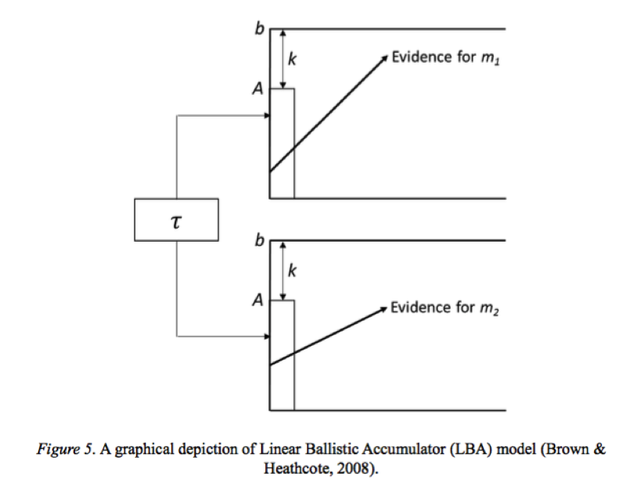

# 使用パッケージ
ワークスペースのクリアをしてから，以下のパッケージを読み込みます。
```{r,message=FALSE}
rm(list=ls(all=TRUE))
#グラフィカルモデル用
require(DiagrammeR)
require(rstan)
```

# LBAのためのStanのユーザー定義関数の説明

 Annisらの[Bayesian inference with Stan: A tutorial on adding custom distributions](http://www.ncbi.nlm.nih.gov/pubmed/27287444)を改変して使った。　LBAの前提として，反応時間は，エビデンスの蓄積が閾値bまで達した時になされる。その際の，エビデンスの蓄積率（傾きに近いもの）は，ドリフトレートdと呼ぶ。各試行のドリフトレートdは，平均v，標準偏差sの正規分布に従っている。各試行の開始点は，0からAの間から一様分布できまる。Non decisionタイムτは，全試行で一定と考える。ある試行の反応時間RTjは，(b-ai/di)の最小値とτを足したものになる（jは試行数，iは選択肢になる。aはAの実現値と思われる）。ちなみに，ここでのkと元のLBAでのkは違うのであまり気にしない。aとdは，推定するパラメータではなく，vi, b, A, s, τ を推定する（sは，今回は１で固定している）。今回，bを直接計算せず，b=k+Aと考えて，k(相対閾値relative threshold)を推定している。

 

## LBAのPDF関数

LBAのProbability density function（確率密度関数）を計算する関数になる。引数は，t，b，A, v_PDF, sになる。入力にたいして，PDFを返す関数になる。　PDFとは，連続確率変数が取りうるある値での相対尤度を記述する関数である。この関数は Annisらのコードをそのまま使用する（書き方はStan2.11以上に合わせた）。LBAのPDFは以下の式から計算される。

$$
f_i (t) = \frac{1}{A} [-v_i Φ(\frac{b-A-tv_i}{ts})+sϕ(\frac{b-A-tv_i}{ts})+v_i Φ(\frac{b-tv_i}{ts})-sϕ(\frac{b-tv_i}{ts})]
$$
```{stan,eval=FALSE,output.var="hoge"}
real lba_pdf(real t, real b, real A, real v_pdf, real s){
      //PDF of the LBA model
      
      real b_A_tv_ts;
      real b_tv_ts;
      real term_1b;
      real term_2b;
      real term_3b;
      real term_4b;
      real pdf;
      
      b_A_tv_ts = (b - A - t * v_pdf) / (t * s);
      b_tv_ts = (b - t * v_pdf) / (t * s);
      term_1b = v_pdf * Phi(b_A_tv_ts);
      term_2b = s * exp(normal_lpdf(fabs(b_A_tv_ts)|0,1)); 
      term_3b = v_pdf * Phi(b_tv_ts);
      term_4b = s * exp(normal_lpdf(fabs(b_tv_ts)|0,1)); 
      pdf = (1/A) * (-term_1b + term_2b + term_3b - term_4b);
      
      return pdf;
 }
```

## LBAのCDF関数

LBAのCumulative Density Function（累積密度関数）を計算する関数になる。引数は，t，b，A, v_cdf, sになる。入力にたいして，CDFを返す関数になる。　PDFとは，CDFとは，ある分布がある値までに累積した確率密度の関数である。この関数は Annisらのコードをそのまま使用する（書き方はStan2.11以上に合わせた）。LBAのCDFは以下の式から計算される。

$$
F_i (t)=1+\frac{b-A-tv_i}{A} Φ(\frac{b-A-tv_i}{ts})-\frac{b-tv_i}{A}Φ\frac{b-tv_i}{ts}+\frac{ts}{A}ϕ(\frac{b-A-tv_i}{ts})-\frac{ts}{A}ϕ(\frac{b-tv_i}{ts})
$$
 
 
```{stan,eval=FALSE,output.var="hoge"}
real lba_cdf(real t, real b, real A, real v_cdf, real s){
    //CDF of the LBA model
    
    real b_A_tv;
    real b_tv;
    real ts;
    real term_1a;
    real term_2a;
    real term_3a;
    real term_4a;
    real cdf;	
    
    b_A_tv = b - A - t * v_cdf;
    b_tv = b - t * v_cdf;
    ts = t * s;
    term_1a = b_A_tv / A * Phi(b_A_tv / ts);	
    term_2a = b_tv / A * Phi(b_tv / ts);
    term_3a = ts / A * exp(normal_lpdf(fabs(b_A_tv / ts)|0,1)); 
    term_4a = ts / A * exp(normal_lpdf(fabs(b_tv / ts)|0,1)); 
    cdf = 1 + term_1a - term_2a + term_3a - term_4a;
    
    return cdf;
    
}
```

## LBAのCDF関数

上で定義した，lba_cdfとlba_pdfは，時間tにおいて，i番目のaccumulatorが閾値に到達した確率密度や累積密度を出している。それを用いて，複数のaccumulatorがある状況において，どのaccumulatorが最初に閾値につくのかに興味がある（つまり，i番目のaccumulatorにおける反応時間のdefective分布に関心がある）。defective確率密度関数は，lab_cdとlba_pdfを使って以下のような式で計算される。以下の場合，i番目のaccumulatorが一番最初に閾値に到達する確率密度関数は，accumulator iの確率密度関数と，(1-それ以外のaccumulatorの累積密度関数)の総積をかけたものになる。つまり，選択肢iを時間tに選ぶ確率＊他の選択肢の累積確率の残りの総積をしている。これは，選択肢iで反応が起こる確率だけでなく，その他の選択肢で反応が起こらない確率も考慮している。


$$
PDF_i (t)=f_i (t)\prod_{j\neq i}(1-F_j (t))
$$

## LBAの対数尤度関数(オリジナル)

Annisらによるlba_logは，パラメータと反応時間を用いて，どちらを選択するかをPDFで計算したうえで，その選択確率の尤度を計算する関数になる。なお，閾値(b)は，開始点の上限＋ｋ（相対閾値）であり，t(decision time)は，反応時間-non decision timeである。引数はmatrix RT, real k, real A, vector v, real s, real psiになる。この関数は，RTを行列にしており，１つの実験のブロック単位での対数尤度を計算する。これは，WAICを計算する上で，少々問題になる（WAICの計算では，各従属変数ごとの対数尤度が必要になる）。以下で，Annisらのコードを改変する。

```{stan,eval=FALSE,output.var="hoge"}
real lba_log(matrix RT, real k, real A, vector v, real s, real psi){
      
      real t;
      real b;
      real cdf;
      real pdf;		
      vector[cols(RT)] prob;
      real out;
      real prob_neg;
      
      b <- A + k;
      for (i in 1: cols(RT)){	
           t <- RT[1, i] - psi;
           if(t > 0){			
                cdf <- 1;
                for(j in 1: num_elements(v)){
                     if(RT[2, i] == j){
                          pdf <- lba_pdf(t, b, A, v[j], s);
                     }else{	
                          cdf <- lba_cdf(t, b, A, v[j], s) * cdf;
                     }
                }
                prob_neg <- 1;
                for(j in 1: num_elements(v)){
                     prob_neg <- Phi(-v[j]/s) * prob_neg;    
                }
                prob[i] <- pdf * (1-cdf);		
                prob[i] <- prob[i] / (1-prob_neg);	
                if(prob[i] < 1e-10){
                     prob[i] <- 1e-10;				
                }
                
           }else{
                prob[i] <- 1e-10;			
           }		
      }
      out <- sum(log(prob));
      return out;		
 }
```

## LBAの対数尤度関数（改変版）

上記の問題点から，各試行ごとに対数尤度を計算する関数を作成した。また，rstan2.11以上に対応するために，<-を=に変更したり，_logを_lpdfに変更した。なお，rstan2.11ではユーザ定義関数を生成量ブロックで使う際にバグが生じて動かなかったが，rstan2.12では改善した。最初に，閾値(b)は，開始点の上限＋ｋ（相対閾値）であり，t(decision time)は，反応時間-non decision timeとしている。Annisらのコードでは，データの引数は，RTだけだったが，このコードでは，RT（１ブロック内の反応時間と反応の３次元配列）をrt（特定の試行の反応時間）とres（特定の試行の反応）に分けている。選択した方の選択肢のPDFと選択してない方のCDF（厳密には，選択してない累積確率）を計算する。それを，prob_negでは，vがマイナスになった場合の対処をとっているらしい。prob = pdf * cdfがPDFの計算になる。最後に，out = log(prob)で対数尤度を計算している。

※　Phiは，cumulative unit normal distribution function。

```{stan,eval=FALSE,output.var="hoge"}
real lba_lpdf(real rt, real res, real k, real A, vector v, real s, real tau){
    
    real t;
    real b;
    real cdf;
    real pdf;		
    real prob;
    real out;
    real prob_neg;

    b = A + k;
    t = rt - tau;
    
    if(t > 0){			
          cdf = 1;
          for(j in 1 : num_elements(v)){
                if(res == j){
                      pdf = lba_pdf(t, b, A, v[j], s);
                }else{	
                      cdf = (1 - lba_cdf(t, b, A, v[j], s)) * cdf;
                }
          }
          
          prob_neg = 1;
          for(j in 1:num_elements(v)){
                prob_neg = Phi(-v[j] / s) * prob_neg;    
          }
          prob = pdf * cdf;		
          prob = prob / (1 - prob_neg);	
          if(prob < 1e-10){
                prob = 1e-10;				
          }
    }else{
        prob = 1e-10;			
    }
    out = log(prob);
    return out;		
}
```


## LBAのrng関数

rngは，乱数発生関数になる。パラメータを引数として，そこから反応時間と反応の乱数を作成する。出力はpredであり，pred[1]が反応時間，pred[2]が反応になる。この関数はAnnisらのコードをそのまま使用する（書き方はStan2.11以上に合わせた）。

```{stan,eval=FALSE,output.var="hoge"}
vector lba_rng(real k, real A, vector v, real s, real psi){
    
    int get_pos_drift;	
    int no_pos_drift;
    int get_first_pos;
    vector[num_elements(v)] drift;
    int max_iter;
    int iter;
    real start[num_elements(v)];
    real ttf[num_elements(v)];
    int resp[num_elements(v)];
    real rt;
    vector[2] pred;
    real b;
    
    //try to get a positive drift rate
    get_pos_drift = 1;
    no_pos_drift = 0;
    max_iter = 1000;
    iter = 0;
    while(get_pos_drift){
         for(j in 1 : num_elements(v)){
              drift[j] = normal_rng(v[j], s);
              if(drift[j] > 0){
                   get_pos_drift = 0;
              }
         }
         iter = iter + 1;
         if(iter > max_iter){
              get_pos_drift = 0;
              no_pos_drift = 1;
         }	
    }
    //if both drift rates are <= 0
    //return an infinite response time
    if(no_pos_drift){
         pred[1] = -1;
         pred[2] = -1;
    }else{
         b = A + k;
         for(i in 1 : num_elements(v)){
              //start time of each accumulator	
              start[i] = uniform_rng(0, A);
              //finish times
              ttf[i] = (b-start[i]) / drift[i];
         }
         //rt is the fastest accumulator finish time	
         //if one is negative get the positive drift
         resp = sort_indices_asc(ttf);
         ttf = sort_asc(ttf);
         get_first_pos = 1;
         iter = 1;
         while(get_first_pos){
              if(ttf[iter] > 0){
                   pred[1] = ttf[iter];
                   pred[2] = resp[iter]; 
                   get_first_pos = 0;
              }
              iter = iter + 1;
         }
    }
    return pred;	
}
```
##　本解析で使用するユーザー定義関数

```{stan,eval=FALSE,output.var="hoge"}
functions{
     
     real lba_pdf(real t, real b, real A, real v, real s){
          //PDF of the LBA model
          
          real b_A_tv_ts;
          real b_tv_ts;
          real term_1;
          real term_2;
          real term_3;
          real term_4;
          real pdf;
          
          b_A_tv_ts = (b - A - t*v)/(t*s);
          b_tv_ts = (b - t*v)/(t*s);
          term_1 = v*Phi(b_A_tv_ts);
          term_2 = s*exp(normal_lpdf(b_A_tv_ts|0,1));
          term_3 = v*Phi(b_tv_ts);
          term_4 = s*exp(normal_lpdf(b_tv_ts|0,1)); 
          pdf = (1 / A)*(-term_1 + term_2 + term_3 - term_4);
          
          return pdf;
     }
     
     real lba_cdf(real t, real b, real A, real v, real s){
          //CDF of the LBA model
          
          real b_A_tv;
          real b_tv;
          real ts;
          real term_1;
          real term_2;
          real term_3;
          real term_4;
          real cdf;	
          
          b_A_tv = b - A - t*v;
          b_tv = b - t*v;
          ts = t*s;
          term_1 = b_A_tv/A * Phi(b_A_tv/ts);	
          term_2 = b_tv/A   * Phi(b_tv/ts);
          term_3 = ts/A     * exp(normal_lpdf(b_A_tv/ts|0,1)); 
          term_4 = ts/A     * exp(normal_lpdf(b_tv/ts|0,1)); 
          cdf = 1 + term_1 - term_2 + term_3 - term_4;
          
          return cdf;
          
     }
     
     real lba_lpdf(real rt, real res, real k, real A, vector v, real s, real tau){
          
          real t;
          real b;
          real cdf;
          real pdf;		
          real prob;
          real out;
          real prob_neg;

          b = A + k;
          t = rt - tau;
          
          if(t > 0){			
                cdf = 1;
                for(j in 1 : num_elements(v)){
                      if(res == j){
                            pdf = lba_pdf(t, b, A, v[j], s);
                      }else{	
                            cdf = (1 - lba_cdf(t, b, A, v[j], s)) * cdf;
                      }
                }
                
                prob_neg = 1;
                for(j in 1 : num_elements(v)){
                      prob_neg = Phi(-v[j]/s) * prob_neg;    
                }
                prob = pdf*cdf;		
                prob = prob/(1 - prob_neg);	
                if(prob < 1e-10){
                      prob = 1e-10;				
                }
          }else{
              prob = 1e-10;			
          }
          out = log(prob);
          return out;		
     }
     
    vector lba_rng(real k, real A, vector v, real s, real tau){
          
          int get_pos_drift;	
          int no_pos_drift;
          int get_first_pos;
          vector[num_elements(v)] drift;
          int max_iter;
          int iter;
          real start[num_elements(v)];
          real ttf[num_elements(v)];
          int resp[num_elements(v)];
          real rt;
          vector[2] pred;
          real b;
          
          //try to get a positive drift rate
          get_pos_drift = 1;
          no_pos_drift = 0;
          max_iter = 1000;
          iter = 0;
          while(get_pos_drift){
               for(j in 1 : num_elements(v)){
                    drift[j] = normal_rng(v[j],s);
                    if(drift[j] > 0){
                         get_pos_drift = 0;
                    }
               }
               iter = iter + 1;
               if(iter > max_iter){
                    get_pos_drift = 0;
                    no_pos_drift = 1;
               }	
          }
          //if both drift rates are <= 0
          //return an infinite response time
          if(no_pos_drift){
               pred[1] = -1;
               pred[2] = -1;
          }else{
               b = A + k;
               for(i in 1 : num_elements(v)){
                    //start time of each accumulator	
                    start[i] = uniform_rng(0, A);
                    //finish times
                    ttf[i] = (b-start[i])/drift[i];
               }
               //rt is the fastest accumulator finish time	
               //if one is negative get the positive drift
               resp = sort_indices_asc(ttf);
               ttf = sort_asc(ttf);
               get_first_pos = 1;
               iter = 1;
               while(get_first_pos){
                    if(ttf[iter] > 0){
                         pred[1] = ttf[iter] + tau;
                         pred[2] = resp[iter]; 
                         get_first_pos = 0;
                    }
                    iter = iter + 1;
               }
          }
          return pred;	
     }
}
```

