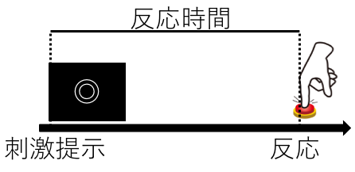
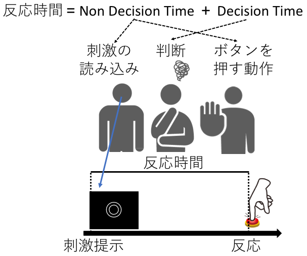
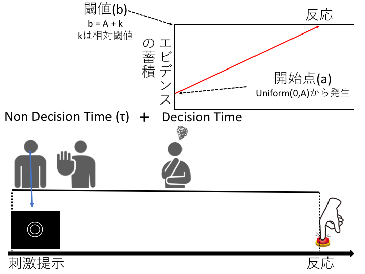
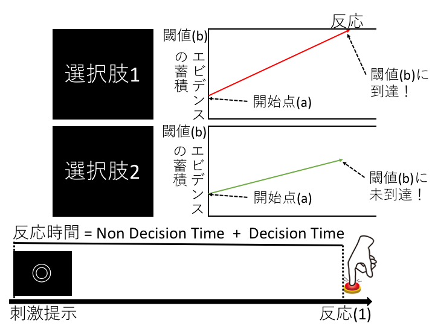

本資料は，[Stan Advent Calendar 2016](http://qiita.com/advent-calendar/2016/stan)に向けて作成した資料です。Linear Ballistic Accumulator modelを用いた反応時間の解析について解説しています。Annis et al. (2016)による [Bayesian inference with Stan: A tutorial on adding custom distributions](http://www.ncbi.nlm.nih.gov/pubmed/27287444)を紹介しつつ，以下の２点を目的としています。

1. Linear Ballistic Accumulator modelを用いた反応時間の解析を理解する
1. Stanでユーザー定義関数を用いる方法を理解する

ちなみ，2016年12月現在，Rstanがggplot2の最新版に対応できてない関係でrstanのtraceplot()が使えなかったので，bayesplotパッケージを使ってみました。これが便利だったので，これの紹介も途中から副次的な目的に追加しました。


# Linear Ballistic Accumulator modelについて
## 反応時間の解析とは？

心理学や神経科学などにおいて，人や動物の行動を対象とした場合、何か刺激を提示してから反応するまでにかかる反応時間を解析することが結構多いです。以下の図のように，二重丸が出てきたらボタンを押すという実験があったとします。この二重丸の提示からボタン押しまでにかかる時間を解析するのが反応時間の解析です。実際は，提示する刺激の性質を変化させたり，反応のルールを操作することで，反応時間に違いが生じるかを調べることが多いです。詳細は，脳科学辞典の[反応時間](https://bsd.neuroinf.jp/wiki/%E5%8F%8D%E5%BF%9C%E6%99%82%E9%96%93)を参照ください。

 

## 従来の反応時間の解析とLinear Ballistic Accumulator model

従来の反応時間の解析では，群間or条件間の平均値の差をt検定や分散分析で検定するということが多かったように思います。そして，統計学的に有意な平均値の差をもって，実験的な刺激の操作や群の違いが反応時間に反映されていると考えます。しかし，反応時間というものをよく考えると，その中にはいろいろな成分が入っています。下の図を見てください。私達が刺激が出てから反応するまでに，(1)刺激の読み込み，(2)判断，(3)ボタンを押す動作の３つがあるかと思います。そのうち多くの研究者が関心をもつのは，「判断」の部分になります。そのため，「刺激の読み込み」と「ボタンを押す動作」のような無判断時間（Non Decision Time）と判断にかかる時間（Decision Time）に分けて考えるほうが自然かと思います。このような反応時間の生成についてのモデルとして，逐次サンプリングモデルがあり，その１つにLinear Ballistic Accumulator modelがあります。逐次サンプリングモデルの代表的なモデルとしては，Drift-Diffusion modelもありますが，今回は，よりシンプルなLinear Ballistic Accumulator modelを取り上げます。Linear Ballistic Accumulator modelは，Brown & Heathcote(2008)による[The simplest complete model of choice response time: Linear ballistic accumulation](https://www.ncbi.nlm.nih.gov/pubmed/18243170)で提案されたモデルになります（数理モデルの導出は，この論文のAppendixを参照ください）。

 

## Linear Ballistic Accumulator modelにおけるDecision Timeの中身

さて，関心のあるDecision Timeの中身をみていきます（下の図では，Non Decision Timeを左側にまとめています）。Linear Ballistic Accumulator modelでは，私たちは判断を下すまでに徐々にその選択をする上でのエビデンスを蓄積し，それが閾値まで溜まったら，判断を下すと考えます（下図の右上の部分）。Drift-Diffusion modelの場合は，この蓄積過程にランダムウォーク的な要素が入りますが，Linear Ballistic Accumulator modelは，まさに，線形な弾道を描いてエビデンスを蓄積していきます。

Linear Ballistic Accumulator modelの前提として，反応時間は，エビデンスの蓄積が閾値(b)まで達した時になされます。その際の，エビデンスの蓄積率は，ドリフト率(d)と呼びます。各試行のドリフト率(d)は，平均v，標準偏差sの正規分布に従います。また，各試行の開始点(a)は，0からA(開始点の上限)の一様分布に従います。そして，Decision Timeは，(b-a)/dで求めることができます。Non  decision Time(τ)は，全試行で一定と考えます。aとdは，推定するパラメータではなく，v, b, A, s, τ が推定するパラメータになります（sは，今回は１で固定している）。今回，閾値(b)は直接計算せず，b=k+Aと考えて，相対閾値(relative threshold: k)を推定しています。

 

## Linear Ballistic Accumulator modelにおける複数選択肢の扱い

Linear Ballistic Accumulator modelでは，複数選択肢の反応時間の解析ができます（Drift-Diffusion modelの場合は，２選択肢に限定されます）。さきほど説明をしましたが，Linear Ballistic Accumulator modelでは，閾値までエビデンスが蓄積されたときに，反応が出力されるという前提があります。選択肢が複数ある場合，最も最初に閾値(b)に到達した選択肢の反応が出力されます（下図の場合，選択肢１の方が，選択肢２よりも先に閾値に到達しているので選択肢１が反応として出力されます）。なお，Linear Ballistic Accumulator modelでは，Decision Timeでエビデンスを蓄積するものをaccumulatorと呼びます（選択肢と言っても良いのですが，エビデンスの蓄積過程を明示的に扱っている感じなのかと思います）。

 

# StanでLinear Ballistic Accumulator modelを使うためのユーザー定義関数の設定

それでは，StanででLinear Ballistic Accumulator modelを使ってみたいのですが，2016年12月の時点では，StanにでLinear Ballistic Accumulator modelにおける対数尤度を計算する関数は存在しません。そこで，functionsブロックで，ユーザー定義関数を設定する必要があります。今回は，Annisらの[Bayesian inference with Stan: A tutorial on adding custom distributions](http://www.ncbi.nlm.nih.gov/pubmed/27287444)で紹介されていた関数を改変して使います。AnnisらのStanコードは，[AnnisのHP](http://www.vanderbilt.edu/psychological_sciences/bio/jeff-annis)にて配布されています。AnnisらのStanコードに対する主な改変点は，(1)Annisらのコードをstan2.10以降の記法に対応（<-を=に変更，_logを_lpdfに変更など），(2)Annisらのコードは，個々の試行の対数尤度を計算してなかったので，試行ごとの対数尤度を計算できるような修正の２点なります。以下では，Annisらのコードを改変したものについて説明をしていきます。

## 特定のaccumulatorの確率密度関数(lba_pdf)

まず，特定のaccumulatorの確率密度関数(Probability density function)を計算する関数を説明します。特定のaccumulatorの確率密度関数は，以下の数式で計算されます(Brown & Heathcote, 2008)。

$$
f_i (t) = \frac{1}{A} [-v_i Φ(\frac{b-A-tv_i}{ts})+sϕ(\frac{b-A-tv_i}{ts})+v_i Φ(\frac{b-tv_i}{ts})-sϕ(\frac{b-tv_i}{ts})]
$$

これをStanコードに落とし込むと，以下のlba_pdfになります。引数は，t，b，A, v_PDF, sになり(v_pdfは，vのことです)，確率密度関数を返します。以下のlba_pdfは Annisらのコードを，Stan2.10以上の記法に修正しただけのものです。

```{stan,eval=FALSE,output.var="hoge"}
real lba_pdf(real t, real b, real A, real v_pdf, real s){

      real b_A_tv_ts;
      real b_tv_ts;
      real term_1b;
      real term_2b;
      real term_3b;
      real term_4b;
      real pdf;
      
      b_A_tv_ts = (b - A - t * v_pdf) / (t * s);
      b_tv_ts = (b - t * v_pdf) / (t * s);
      term_1b = v_pdf * Phi(b_A_tv_ts);
      term_2b = s * exp(normal_lpdf(fabs(b_A_tv_ts)|0,1)); 
      term_3b = v_pdf * Phi(b_tv_ts);
      term_4b = s * exp(normal_lpdf(fabs(b_tv_ts)|0,1)); 
      pdf = (1/A) * (-term_1b + term_2b + term_3b - term_4b);
      
      return pdf;
 }
```

## 特定のaccumulatorの累積密度関数(lba_cdf)

次に特定のaccumulatorの累積密度関数(Cumulative Density Function)を計算する関数を説明します。特定のaccumulatorの累積密度関数は，以下の数式で計算されますす(Brown & Heathcote, 2008)。

$$
F_i (t)=1+\frac{b-A-tv_i}{A} Φ(\frac{b-A-tv_i}{ts})-\frac{b-tv_i}{A}Φ\frac{b-tv_i}{ts}+\frac{ts}{A}ϕ(\frac{b-A-tv_i}{ts})-\frac{ts}{A}ϕ(\frac{b-tv_i}{ts})
$$

これをStanコードに落とし込むと，以下のlba_cdfになります。引数は，t，b，A, v_cdf, sになり(v_cdfは，vのことです)，累積密度関数を返します。以下のlba_cdfは，Annisらのコードを，，Stan2.10以上の記法に修正しただけのものです。

```{stan,eval=FALSE,output.var="hoge"}
real lba_cdf(real t, real b, real A, real v_cdf, real s){

    real b_A_tv;
    real b_tv;
    real ts;
    real term_1a;
    real term_2a;
    real term_3a;
    real term_4a;
    real cdf;	
    
    b_A_tv = b - A - t * v_cdf;
    b_tv = b - t * v_cdf;
    ts = t * s;
    term_1a = b_A_tv / A * Phi(b_A_tv / ts);	
    term_2a = b_tv / A * Phi(b_tv / ts);
    term_3a = ts / A * exp(normal_lpdf(fabs(b_A_tv / ts)|0,1)); 
    term_4a = ts / A * exp(normal_lpdf(fabs(b_tv / ts)|0,1)); 
    cdf = 1 + term_1a - term_2a + term_3a - term_4a;
    
    return cdf;
}
```

## 特定のaccumulatorが最初に閾値に到達する確率密度関数についての対数尤度関数(lba_lpdf)

上で定義した，lba_cdfとlba_pdfは，時間tにおいて，i番目のaccumulatorが閾値に到達した確率密度や累積密度を算出するものです。これら２つを用いて，複数のaccumulatorがある状況で，どのaccumulatorが最初に閾値に到達するのかに関する確率密度関数を算出するのが以下の数式になります。以下の数式をみると，i番目のaccumulatorが一番最初に閾値に到達する確率密度関数は，accumulator iの確率密度関数と，(1-それ以外のaccumulatorの累積密度関数)の総積をかけたものになります。ざっくり説明すると，選択肢(accumulator)iを時間tに選ぶ確率と他の選択肢(accumulator)の累積確率の残りの総積を掛け合わせています。つまり，選択肢iで閾値にが起こる確率だけでなく，その他の選択肢で反応が起こらない確率も考慮しています。

$$
PDF_i (t)=f_i (t)\prod_{j\neq i}(1-F_j (t))
$$


Annisらによるlba_logは，パラメータと反応時間を用いて，どちらを選択するかをPDFで計算したうえで，その選択確率の尤度を計算する関数になる。なお，閾値(b)は，開始点の上限＋ｋ（相対閾値）であり，t(decision time)は，反応時間-non decision timeである。引数はmatrix RT, real k, real A, vector v, real s, real psiになる。この関数は，RTを行列にしており，１つの実験のブロック単位での対数尤度を計算する。これは，WAICを計算する上で，少々問題になる（WAICの計算では，各従属変数ごとの対数尤度が必要になる）。以下で，Annisらのコードを改変する。


上記の問題点から，各試行ごとに対数尤度を計算する関数を作成した。また，rstan2.11以上に対応するために，<-を=に変更したり，_logを_lpdfに変更した。なお，rstan2.11ではユーザ定義関数を生成量ブロックで使う際にバグが生じて動かなかったが，rstan2.12では改善した。最初に，閾値(b)は，開始点の上限＋ｋ（相対閾値）であり，t(decision time)は，反応時間-non decision timeとしている。Annisらのコードでは，データの引数は，RTだけだったが，このコードでは，RT（１ブロック内の反応時間と反応の３次元配列）をrt（特定の試行の反応時間）とres（特定の試行の反応）に分けている。選択した方の選択肢のPDFと選択してない方のCDF（厳密には，選択してない累積確率）を計算する。それを，prob_negでは，vがマイナスになった場合の対処をとっているらしい。prob = pdf * cdfがPDFの計算になる。最後に，out = log(prob)で対数尤度を計算している。

※　Phiは，cumulative unit normal distribution function。

```{stan,eval=FALSE,output.var="hoge"}
real lba_lpdf(real rt, real res, real k, real A, vector v, real s, real tau){
    
    real t;
    real b;
    real cdf;
    real pdf;		
    real prob;
    real out;
    real prob_neg;

    b = A + k;
    t = rt - tau;
    
    if(t > 0){			
          cdf = 1;
          for(j in 1 : num_elements(v)){
                if(res == j){
                      pdf = lba_pdf(t, b, A, v[j], s);
                }else{	
                      cdf = (1 - lba_cdf(t, b, A, v[j], s)) * cdf;
                }
          }
          
          prob_neg = 1;
          for(j in 1:num_elements(v)){
                prob_neg = Phi(-v[j] / s) * prob_neg;    
          }
          prob = pdf * cdf;		
          prob = prob / (1 - prob_neg);	
          if(prob < 1e-10){
                prob = 1e-10;				
          }
    }else{
        prob = 1e-10;			
    }
    out = log(prob);
    return out;		
}
```


## LBAのrng関数

rngは，乱数発生関数になる。パラメータを引数として，そこから反応時間と反応の乱数を作成する。出力はpredであり，pred[1]が反応時間，pred[2]が反応になる。この関数はAnnisらのコードをそのまま使用する（書き方はStan2.11以上に合わせた）。

```{stan,eval=FALSE,output.var="hoge"}
vector lba_rng(real k, real A, vector v, real s, real psi){
    
    int get_pos_drift;	
    int no_pos_drift;
    int get_first_pos;
    vector[num_elements(v)] drift;
    int max_iter;
    int iter;
    real start[num_elements(v)];
    real ttf[num_elements(v)];
    int resp[num_elements(v)];
    real rt;
    vector[2] pred;
    real b;
    
    //try to get a positive drift rate
    get_pos_drift = 1;
    no_pos_drift = 0;
    max_iter = 1000;
    iter = 0;
    while(get_pos_drift){
         for(j in 1 : num_elements(v)){
              drift[j] = normal_rng(v[j], s);
              if(drift[j] > 0){
                   get_pos_drift = 0;
              }
         }
         iter = iter + 1;
         if(iter > max_iter){
              get_pos_drift = 0;
              no_pos_drift = 1;
         }	
    }
    //if both drift rates are <= 0
    //return an infinite response time
    if(no_pos_drift){
         pred[1] = -1;
         pred[2] = -1;
    }else{
         b = A + k;
         for(i in 1 : num_elements(v)){
              //start time of each accumulator	
              start[i] = uniform_rng(0, A);
              //finish times
              ttf[i] = (b-start[i]) / drift[i];
         }
         //rt is the fastest accumulator finish time	
         //if one is negative get the positive drift
         resp = sort_indices_asc(ttf);
         ttf = sort_asc(ttf);
         get_first_pos = 1;
         iter = 1;
         while(get_first_pos){
              if(ttf[iter] > 0){
                   pred[1] = ttf[iter];
                   pred[2] = resp[iter]; 
                   get_first_pos = 0;
              }
              iter = iter + 1;
         }
    }
    return pred;	
}
```

# RStanによるLinear Ballistic Accumulator modelを用いた解析

## 使用パッケージ
ワークスペースのクリアをして，以下のパッケージを読み込みます。
```{r, message=FALSE, warning=FALSE}
rm(list=ls(all=TRUE))
#グラフィカルモデル用
library(DiagrammeR)
#グラフ作成用
library(ggplot2)
library(plotly)
library(bayesplot)
#Stan用
library(rstan)
library(loo)
#LBA用データの生成
library(rtdists)
```

## グラフィカルモデル

grVizを使ってグラフィカルモデルを描いてみました。むしろ面倒ではないかという気もしますが(例えば，sとLBAの間のエッジはそのままだと隣のノードと重なるので，tailportとかheadportとのか設定を追加しています)，なれると便利です。

```{r}
grViz("
  digraph dot {
    graph [splines = line,compound = true, nodesep = .5, ranksep = .25,
           color = black, label='Linear Ballistic Accumulator Model for single participant']
      node [shape = circle,style = filled,fillcolor = white,color = black,label = 'k'] k
      node [label = 'A'] A
      node [label = '&tau;'] t
      node [label = 'v[1]'] v1
      node [label = 'v[2]'] v2
      node [label = 'S'] s
      node [label = 'LBA@_{t}'] lba
      node [fillcolor = grey,label = 'RT@_{t}'] rt
        subgraph cluster3 {
          labelloc=b
          label = 'Trials t = 1...T'
            edge [color = black]
              lba -> rt
        }
      edge [color = black]
        A -> lba
        v1 -> lba
        v2 -> lba
        k -> lba
        t -> lba
        s -> lba [taolport=s,headport=e]
  }",engine = "dot")
```

事前分布は以下になります。
$$ 
k \sim Normal(.5,1)T[0,]\\
A \sim Normal(.5,1)T[0,]\\
\tau \sim Normal(.5,.5)T[0,]\\
v[1],v[2] \sim Normal(2,1)T[0,]\\
S = 1 \hspace{30pt}※Sは定数
$$


## データの作成

```{r, message=FALSE, warning=FALSE}
#データセットの作成（t0 = non decision time）
set.seed(123)
data <- rLBA(500, A=0.5, b=1, t0 = 0.5, mean_v=c(2, 1.5), sd_v=c(1,1))
trialLength = length(data$rt)
stanData <- list(rt=data$rt,res=data$response,LENGTH=trialLength,NUM_CHOICES=2)
```


##　データの確認
```{r, message=FALSE, warning=FALSE}
table(data$response)

# 選択肢1の反応時間
data1 <- subset(data,data$response==1)
p1 <- ggplot(data1,aes(x = rt)) + geom_histogram()+coord_cartesian(xlim = c(0, 3), ylim = c(0, 70))

# 選択肢2の反応時間
data2 <- subset(data,data$response==2)
p2 <- ggplot(data2,aes(x = rt)) + geom_histogram()+coord_cartesian(xlim = c(0, 3), ylim = c(0, 70))
subplot(p1, p2)
```

## Stanコード


※なお，以降は，kazutan氏の[Stan Advent 2016の記事](http://qiita.com/kazutan/items/6cc162bc3c4b1b9062f2)を参考に，R MarkdownにStanコード直書きしてコンパイルする方法をとっています（私のRの利用の仕方からすると，これ便利です）。


```{stan output.var="lbaModel"}
functions{
     
     real lba_pdf(real t, real b, real A, real v, real s){
          //PDF of the LBA model
          
          real b_A_tv_ts;
          real b_tv_ts;
          real term_1;
          real term_2;
          real term_3;
          real term_4;
          real pdf;
          
          b_A_tv_ts = (b - A - t*v)/(t*s);
          b_tv_ts = (b - t*v)/(t*s);
          term_1 = v*Phi(b_A_tv_ts);
          term_2 = s*exp(normal_lpdf(b_A_tv_ts|0,1)); 
          term_3 = v*Phi(b_tv_ts);
          term_4 = s*exp(normal_lpdf(b_tv_ts|0,1)); 
          pdf = (1/A)*(-term_1 + term_2 + term_3 - term_4);
          
          return pdf;
     }
     
     real lba_cdf(real t, real b, real A, real v, real s){
          //CDF of the LBA model
          
          real b_A_tv;
          real b_tv;
          real ts;
          real term_1;
          real term_2;
          real term_3;
          real term_4;
          real cdf;	
          
          b_A_tv = b - A - t*v;
          b_tv = b - t*v;
          ts = t*s;
          term_1 = b_A_tv/A * Phi(b_A_tv/ts);	
          term_2 = b_tv/A   * Phi(b_tv/ts);
          term_3 = ts/A     * exp(normal_lpdf(b_A_tv/ts|0,1)); 
          term_4 = ts/A     * exp(normal_lpdf(b_tv/ts|0,1)); 
          cdf = 1 + term_1 - term_2 + term_3 - term_4;
          
          return cdf;
          
     }
     
    real lba_lpdf(real rt, real res, real k, real A, vector v, real s, real tau){
        
        real t;
        real b;
        real cdf;
        real pdf;		
        real prob;
        real out;
        real prob_neg;
    
        b = A + k;
        t = rt - tau;
        
        if(t > 0){			
              cdf = 1;
              for(j in 1 : num_elements(v)){
                    if(res == j){
                          pdf = lba_pdf(t, b, A, v[j], s);
                    }else{	
                          cdf = (1 - lba_cdf(t, b, A, v[j], s)) * cdf;
                    }
              }
              
              prob_neg = 1;
              for(j in 1:num_elements(v)){
                    prob_neg = Phi(-v[j] / s) * prob_neg;    
              }
              prob = pdf * cdf;		
              prob = prob / (1 - prob_neg);	
              if(prob < 1e-10){
                    prob = 1e-10;				
              }
        }else{
            prob = 1e-10;			
        }
        out = log(prob);
        return out;		
    }
     
    vector lba_rng(real k, real A, vector v, real s, real tau){
          
          int get_pos_drift;	
          int no_pos_drift;
          int get_first_pos;
          vector[num_elements(v)] drift;
          int max_iter;
          int iter;
          real start[num_elements(v)];
          real ttf[num_elements(v)];
          int resp[num_elements(v)];
          real rt;
          vector[2] pred;
          real b;
          
          //try to get a positive drift rate
          get_pos_drift = 1;
          no_pos_drift = 0;
          max_iter = 1000;
          iter = 0;
          while(get_pos_drift){
               for(j in 1:num_elements(v)){
                    drift[j] = normal_rng(v[j],s);
                    if(drift[j] > 0){
                         get_pos_drift = 0;
                    }
               }
               iter = iter + 1;
               if(iter > max_iter){
                    get_pos_drift = 0;
                    no_pos_drift = 1;
               }	
          }
          //if both drift rates are <= 0
          //return an infinite response time
          if(no_pos_drift){
               pred[1] = -1;
               pred[2] = -1;
          }else{
               b = A + k;
               for(i in 1:num_elements(v)){
                    //start time of each accumulator	
                    start[i] = uniform_rng(0,A);
                    //finish times
                    ttf[i] = (b-start[i])/drift[i];
               }
               //rt is the fastest accumulator finish time	
               //if one is negative get the positive drift
               resp = sort_indices_asc(ttf);
               ttf = sort_asc(ttf);
               get_first_pos = 1;
               iter = 1;
               while(get_first_pos){
                    if(ttf[iter] > 0){
                         pred[1] = ttf[iter] + tau;
                         pred[2] = resp[iter]; 
                         get_first_pos = 0;
                    }
                    iter = iter + 1;
               }
          }
          return pred;	
     }
}

data{
     int LENGTH;
     int NUM_CHOICES;
     vector[LENGTH] rt;
     vector[LENGTH] res;
}

parameters {
     real<lower=0> k;
     real<lower=0> A;
     real<lower=0> tau;
     vector<lower=0>[NUM_CHOICES] v;
}

transformed parameters {
     real s;
     s = 1;
}

model {
     k ~ normal(.5,1)T[0,];
     A ~ normal(.5,1)T[0,];
     tau ~ normal(.5,.5)T[0,];
     for(n in 1:NUM_CHOICES){
          v[n] ~ normal(2,1)T[0,];
     }
     
     for(m in 1:LENGTH){
          rt[m] ~ lba(res[m],k,A,v,s,tau);
     }
}

generated quantities {
     vector[2] pred;
     vector[LENGTH] log_lik;
     
     pred = lba_rng(k,A,v,s,tau);
    
     for(i in 1 : LENGTH){
          log_lik[i] = lba_lpdf(rt[i] | res[i], k, A, v, s, tau);
     }
}
```


## Rstanによるサンプリング

```{r, message=FALSE, warning=FALSE}
rstan_options(auto_write=TRUE)
options(mc.cores = parallel::detectCores())
hmcIter = 1000
hmcChains = 4
hmcWarmup = 300
hmcThin = 2

fit <- sampling(lbaModel, 
            seed = 1234, 
            data = stanData,
            warmup = hmcWarmup, 
            iter = hmcIter,
            chains = hmcChains,
            thin =hmcThin)
```

## 結果

### 収束判定{.tabset}
まあ，収束してそうですね。収束判定には，bayesplotを活用しています。[このページ](https://cran.rstudio.com/web/packages/bayesplot/vignettes/MCMC-diagnostics.html)が参考になりました。
なお，定数のSは除外しています。

#### トレースプロット
```{r, message=FALSE, warning=FALSE}
posterior1 <- extract(fit, inc_warmup = TRUE, permuted = FALSE)
color_scheme_set("mix-blue-pink")
p <- mcmc_trace(posterior1,  pars = c("k", "A", "tau", "v[1]", "v[2]"), n_warmup = 125,
                facet_args = list(nrow = 2, labeller = label_parsed))
p <- p+ facet_text(size = 15)
plot(p)
```

#### $\hat{R}$の確認

```{r, message=FALSE, warning=FALSE}
color_scheme_set("brightblue")
rhats <- rhat(fit,par = c("k", "A", "tau", "v[1]", "v[2]"))
print(rhats)
mcmc_rhat(rhats) + yaxis_text()
```

#### 有効サンプルサイズ
```{r, message=FALSE, warning=FALSE}
neffRatios <- neff_ratio(fit,par = c("k", "A", "tau", "v[1]", "v[2]"))
print(neffRatios)
mcmc_neff(neffRatios) + yaxis_text()
```

#### 自己相関
```{r, message=FALSE, warning=FALSE}
posterior2 <- as.matrix(fit)
mcmc_acf(posterior2, pars = c("k","A","tau","v[1]","v[2]"), lags = 10)
```

### No-U-Turn Samplerの診断{.tabset}
#### Divergent transitions

```{r, message=FALSE, warning=FALSE}
mcmc_nuts_divergence(nuts_params(fit), log_posterior(fit))
```

#### Energy and Bayesian fraction of missing information

```{r, message=FALSE, warning=FALSE}
mcmc_nuts_energy(nuts_params(fit),merge_chains = FALSE)
```

### 推定結果

```{r, message=FALSE, warning=FALSE}
extractFit <- rstan::extract(fit)
# MAP推定値計算関数
mapEstimate <- function(z){
  density(z)$x[which.max(density(z)$y)]
}

kMap <- mapEstimate(extractFit$k)
AMap <- mapEstimate(extractFit$A)
tauMap <- mapEstimate(extractFit$tau)
v1Map <- mapEstimate(extractFit$v[,1])
v2Map <- mapEstimate(extractFit$v[,2])

print(fit,par = c("k", "A", "tau", "v[1]", "v[2]","s"))
# MAP推定値
print(paste("k=",kMap,",A=",AMap,",tau=",tauMap,",v1=",v1Map,",v2=",v2Map))
```

```{r, message=FALSE, warning=FALSE}
mcmc_areas(posterior2, pars = c("k", "A", "tau", "v[1]", "v[2]"), prob = 0.95)
```

### 事後予測チェック

```{r, message=FALSE, warning=FALSE}
predRt = posterior2[,'pred[1]']
predRes = posterior2[,'pred[2]']
postPredData <- data.frame(predRt,predRes)

# 事後予測サンプルから500個抽出その１
set.seed(321)
sampleId<-sample(nrow(postPredData),500)
postPredData1<-postPredData[sampleId,]

# 事後予測サンプルから500個抽出その２
set.seed(123)
sampleId<-sample(nrow(postPredData),500)
postPredData2<-postPredData[sampleId,]

# クロス表で確認
table(data$response)
table(postPredData1$predRes)
table(postPredData2$predRes)
```

```{r, message=FALSE, warning=FALSE}
# データの選択肢1の反応時間
data1 <- subset(data,data$response==1)
p1 <- ggplot(data1,aes(x = rt)) + geom_histogram()+coord_cartesian(xlim = c(0, 3), ylim = c(0, 70)) 

# データの選択肢2の反応時間
data2 <- subset(data,data$response==2)
p2 <- ggplot(data2,aes(x = rt)) + geom_histogram()+coord_cartesian(xlim = c(0, 3), ylim = c(0, 70))+ ggtitle("データの反応時間のヒストグラム（左が選択肢１，右が選択肢２）")
subplot(p1,p2)

# 事後予測の選択肢1の反応時間
postPredData11 <- subset(postPredData1,postPredData$predRes==1)
p3 <- ggplot(postPredData11,aes(x = predRt)) + geom_histogram()+coord_cartesian(xlim = c(0, 3), ylim = c(0, 70))
#　事後予測の選択肢2の反応時間
postPredData12 <- subset(postPredData1,postPredData$predRes==2)
p4 <- ggplot(postPredData12,aes(x = predRt)) + geom_histogram()+coord_cartesian(xlim = c(0, 3), ylim = c(0, 70))+ ggtitle("事後予測の反応時間のヒストグラム　その１（左が選択肢１，右が選択肢２）")
subplot(p3,p4)

# 事後予測の選択肢1の反応時間
postPredData21 <- subset(postPredData2,postPredData$predRes==1)
p5 <- ggplot(postPredData21,aes(x = predRt)) + geom_histogram()+coord_cartesian(xlim = c(0, 3), ylim = c(0, 70))
#　事後予測の選択肢2の反応時間
postPredData22 <- subset(postPredData2,postPredData$predRes==2)
p6 <- ggplot(postPredData22,aes(x = predRt)) + geom_histogram()+coord_cartesian(xlim = c(0, 3), ylim = c(0, 70))+ ggtitle("事後予測の反応時間のヒストグラム　その２（左が選択肢１，右が選択肢２）")
subplot(p5,p6)
```


### 情報量基準(WAICとLOOCV)の算出
@berobero11氏の[Stan Advent 2016](http://statmodeling.hatenablog.com/entry/comparison-of-LOOCV-and-WAIC)を参考にしつつWAICとLOOCVの算出をしてみた。今回は，あまり意味ないけど，今後モデル比較する場合には，活用できる。

```{r}
loo::loo(extractFit$log_lik)$looic/(2*trialLength)
loo::waic(extractFit$log_lik)$waic/(2*trialLength)
```

ここまで出来たら，複数の参加者のデータに対して階層ベイズにもっていきたいところですが，ちょっと分量が長くなりすぎてしまったので，またの機会に！  


**Enjoy!**
